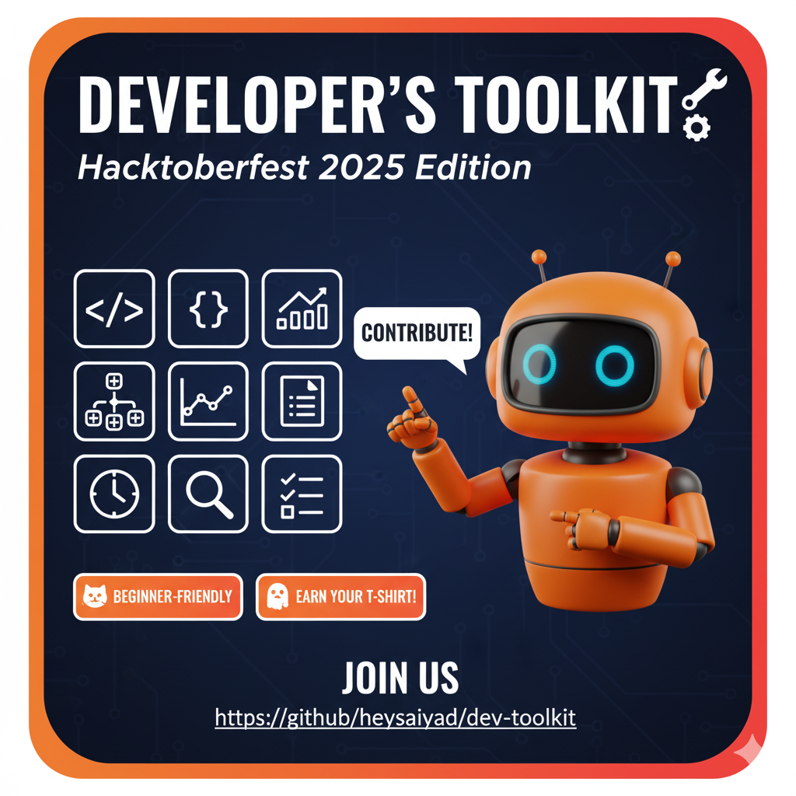

# 🛠️ DevToolkit - Hacktoberfest 2025

<div align="center">



### 🚀 The Ultimate Collection of Developer Tools
*Beautiful • Modern • Open Source • Beginner Friendly*

[](https://hacktoberfest.com)
[](https://heysaiyad.github.io/dev-toolkit/)
[](https://github.com/heysaiyad/dev-toolkit)


</div>

---

## 🌟 What is DevToolkit?

**DevToolkit** is a stunning collection of **powerful web-based developer tools** designed to boost your productivity! Built with modern web technologies and featuring a beautiful dark theme, it's the perfect project for **Hacktoberfest 2025** contributors.

### ✨ Why DevToolkit?

- 🎨 **Modern Design** - Beautiful dark theme with Hacktoberfest colors
- 📱 **Mobile Responsive** - Works perfectly on all devices
- ⚡ **Lightning Fast** - Pure HTML/CSS/JS, no frameworks needed
- 🔧 **Developer Friendly** - Easy to contribute and extend
- 🎯 **Beginner Friendly** - Perfect for first-time contributors
- 🌍 **Open Source** - Built by the community, for the community

---

## 🛠️ Available Tools

<div align="center">

| Tool | Description | Status | Category |
|------|-------------|--------|----------|
| 📝 **Word Counter** | Advanced text analysis with real-time stats | ✅ Live | Text |
| 🔧 **JSON Formatter** | Format and validate JSON data | 🚧 Coming Soon | Code |
| 🎨 **Color Picker** | Advanced color selection tool | 🚧 Coming Soon | Utility |
| 🔐 **Password Generator** | Secure password generation | 🚧 Coming Soon | Security |
| 📐 **Base64 Encoder** | Encode/decode Base64 strings | 🚧 Coming Soon | Converter |
| 🔍 **RegEx Tester** | Test regular expressions | 🚧 Coming Soon | Code |

</div>

> 💡 **Want to add a tool?** Check our [Tool Ideas](CONTRIBUTING.md#-tool-ideas) section!

---

## 🚀 Live Demo

<div align="center">

[](https://heysaiyad.github.io/dev-toolkit/)

*Experience the beauty of DevToolkit in action!*

</div>

---

## 🎯 Perfect for Hacktoberfest 2025!

<div align="center">


**Ready to make your mark in open source?**

✅ Beginner-friendly issues
✅ Clear contribution guidelines
✅ Responsive maintainers
✅ Quality code reviews
✅ Recognition for contributors

</div>

### 🏆 Contributor Benefits

- 🌟 **GitHub Profile Enhancement** - Show off your open source contributions
- 🎓 **Learning Experience** - Learn modern web development
- 🤝 **Community Recognition** - Get featured on our contributors page
- 🎁 **Hacktoberfest Rewards** - Earn official Hacktoberfest swag
- 📈 **Portfolio Building** - Add impressive projects to your portfolio

---

## 🚀 Quick Start Guide

### 📋 Prerequisites

- A GitHub account
- Basic knowledge of HTML/CSS/JavaScript
- Enthusiasm to contribute! 🔥

### 🛠️ Installation

```bash
# 1. Fork this repository (click the Fork button above)

# 2. Clone your fork
git clone https://github.com/heysaiyad/dev-toolkit.git

# 3. Navigate to the project
cd dev-toolkit

# 4. Create a new branch
git checkout -b my-awesome-tool

# 5. Open index.html in your browser
# That's it! No build process needed 🎉
```

### 🎨 Adding Your First Tool

1. **Read the Template**: Check [`TOOL_TEMPLATE.md`](TOOL_TEMPLATE.md) for complete guidelines
2. **Create Your Tool**: Follow the provided HTML/CSS/JS template
3. **Test Thoroughly**: Ensure it works on desktop and mobile
4. **Submit PR**: Follow our PR template for quick reviews

> 📖 **Detailed Guide**: See [`CONTRIBUTING.md`](CONTRIBUTING.md) for step-by-step instructions

---

## 🌍 Community

<div align="center">

### 💬 Join the Conversation

[](https://github.com/heysaiyad/dev-toolkit/discussions)
[](https://github.com/heysaiyad/dev-toolkit/issues)

</div>

### 🤝 How to Connect

- 🐛 **Found a Bug?** [Open an Issue](https://github.com/heysaiyad/dev-toolkit/issues/new)
- 💡 **Have an Idea?** [Start a Discussion](https://github.com/heysaiyad/dev-toolkit/discussions)
- 🔥 **Want to Contribute?** Check our [Good First Issues](https://github.com/heysaiyad/dev-toolkit/labels/good%20first%20issue)

---

## 👨‍💻 Creator

<div align="center">


**Md Saiyad Ali**
*Full Stack Developer & Open Source Enthusiast*

[](https://www.linkedin.com/in/heysaiyad)
[](https://github.com/heysaiyad)

</div>

---

## 🏆 Contributors Wall

<div align="center">

### 🌟 Amazing People Who Made This Possible

[](https://github.com/heysaiyad/dev-toolkit/graphs/contributors)

*Want to see your avatar here? [Contribute now!](CONTRIBUTING.md)*

</div>

---

## 📊 Project Stats

<div align="center">


</div>

---

## 📄 License

<div align="center">


This project is licensed under the **MIT License** - see the [LICENSE](LICENSE) file for details.

</div>

---

## 🎉 Support the Project

<div align="center">

### Show Some Love! ❤️

If you found this project helpful, please consider:

⭐ **Starring** this repository
🍴 **Forking** for your own experiments
📢 **Sharing** with fellow developers
🐛 **Reporting** issues you find
🔥 **Contributing** new tools

[](https://star-history.com/#heysaiyad/dev-toolkit&Date)

</div>

---

## 🚀 What's Next?

<div align="center">

### 🛣️ Roadmap

- [ ] 🔧 Add 10+ essential developer tools
- [ ] 🎨 Dark/Light theme toggle
- [ ] 📱 Progressive Web App (PWA) support
- [ ] 🌐 Multi-language support
- [ ] 🔍 Tool search and filtering
- [ ] 📊 Usage analytics dashboard
- [ ] 🎮 Gamification for contributors

*Have an idea? [Let us know!](https://github.com/heysaiyad/dev-toolkit/discussions)*

</div>

---

<div align="center">

### 🎯 Ready to Contribute?

[](CONTRIBUTING.md)

**Join hundreds of developers building the future of web development tools!**

---

**Made with ❤️ for the developer community • Happy Hacktoberfest 2025! 🎃**

</div>
